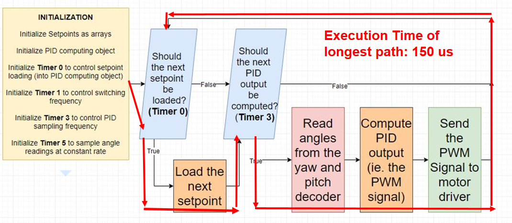

# Laser Lightshow (The Two-DOF Robotic Arm)
## Summary
This is a four-month long project I completed in my third year, in a team of four Electrical Engineering students. The project's aim is to build a laser lightshow system. The system should have a laser pointer mounted on a robotic arm driven by two brushless DC motors, and controlled by a microcontroller. Once a user turns the system on, the motor-driven laser should draw out a figure in continuous frames.   The project required students to build the motors themselves, design a control algorithm with the help of MATLAB and Simulink, implement the algorithm on the microcontroller, and to build a PCB to host peripherals (position sensors, motor drivers, etc.)
  

## My role
Each team of four people was split into two groups - a motor group and a control group. The motor group works on building the motor, whereas the control group focuses on modeling, writing code for the microcontroller, and building PCBs. I worked in the control group with [Shalin Hudda](https://ca.linkedin.com/in/shalin-hudda-888886164). Throughout the four months I mainly worked with MATLAB, Simulink, and Arduino programming.
  

## Timeline
The project is comprised of three phases. After each phrase, we had to demo our work to TAs and the instructor. Here are the tasks a motor group was required to complete by the end of each phase:

### Phase 1:
* Measured parameters of a commercial motor
* Built a rought Simulink/MATLAB model for the one-motor system
* Wrote up some code to control the motor
* Assembled an encoder (a position sensor) and being able to read position from it

### Phase 2:
* Completed the Simulink/MATLAB model for the one-motor system
* Completed a PID control algorithm to control the commercial motor
* Got the entire one-motor system working (full-operational circuit on breadboard with working encoder)

### Phase 3:
* Measured parameters for the two motors made by the motor group
* Completed a Simulink/MATLAB model for the two-motor system
* Got the entire two-motor system working. In other words, two hand-made motors controlled by PID algorithms running on a controller with circuits on PCB
  

## Highlights

### Measuring motor parameters
We used a small commercial DC motor like this:

By measuring motor parameters, I mean determining a motor's electrical-mechanical properties. We needed to do this because once we got these parameters, we could put them into our Simulink/MATLAB model which would help us "predict" how a motor behave under different voltage inputs. Thus we could let a motor rotate in a particular way, to draw a pattern out and get a laser lightshow done.  
An abstract way to think of a DC motor is to consider it as a circuit with three components: a resistor, an inductor, and a backward-EMF-generating rotor:

*A BLDC Motor's Circuit Diagram. Cited from: DC Servomotor-based Antenna Positioning Control System Design using Hybrid PID-LQR Controller - Scientific Figure on ResearchGate. Available from: https://www.researchgate.net/figure/DC-motor-circuit-diagram_fig2_303910207 [accessed 11 Jan, 2020]*

The diagram above has shown a few (not all) parameters I had to measure: resistance Ra, inductance La, and the backward EMF when a particular input voltage (Va) was given. 

### System Modelling
Controlling a motor with PID required me to know the values of PID constants - Kp, Ki and Kd. So I built a model in Simulink/MATLAB to help me find the combination of three values that would work. This is the thing I built:

*The image is taken from our group report*

I can probably elaborate how I found the PID constants, but you'll probably get bored. But essentially I did a bunch of math. Once I have got a set of three constants, I could plug them into the orange part of the simulation. The motor parameters went into the dark blue parts. Then I ran the simulation to see of the constants could make the motors rotate in a way I wanted them to.

### Writing up code
We used software running on an Arduino board to control our motors. The software was written in C++. The software was structured as an infinite loop. Within each iteration, it checks the current position of the laser tip, see if the tip has got to a desired position; if not then it would send PWM signals to motor drivers, so the motors get powered up, and puts the laser tip at the right place. Here is an architectural illustration of our control software:

*The image is taken from our group report*