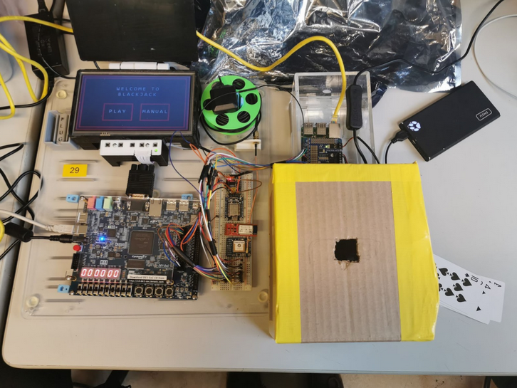
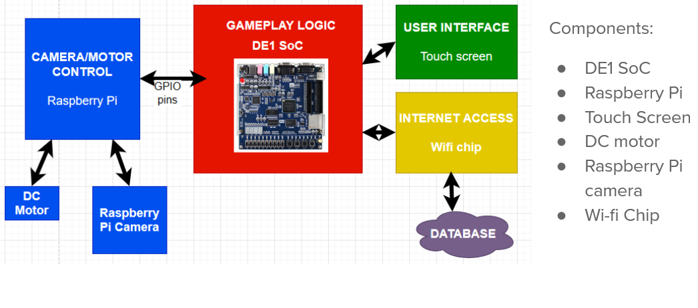
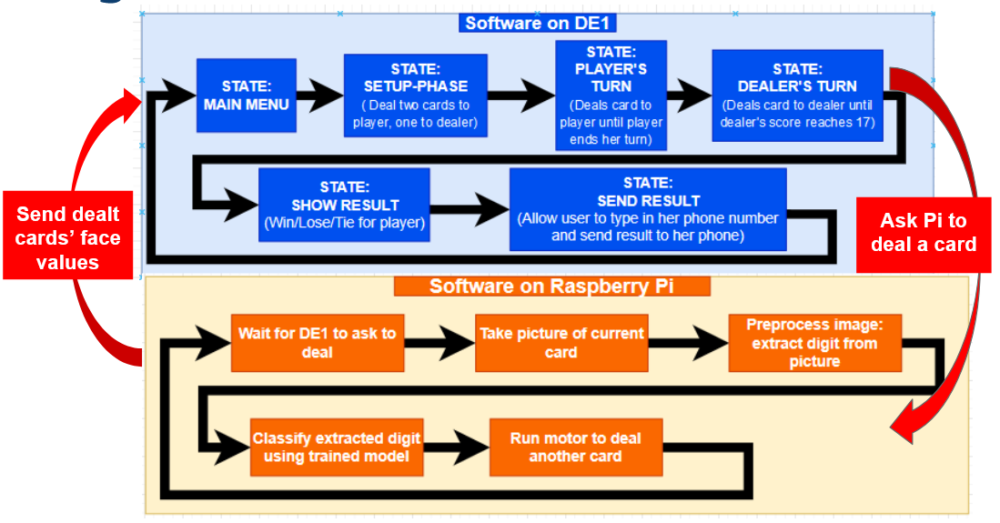
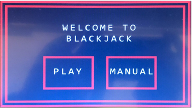
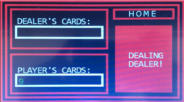
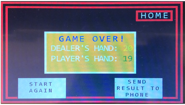
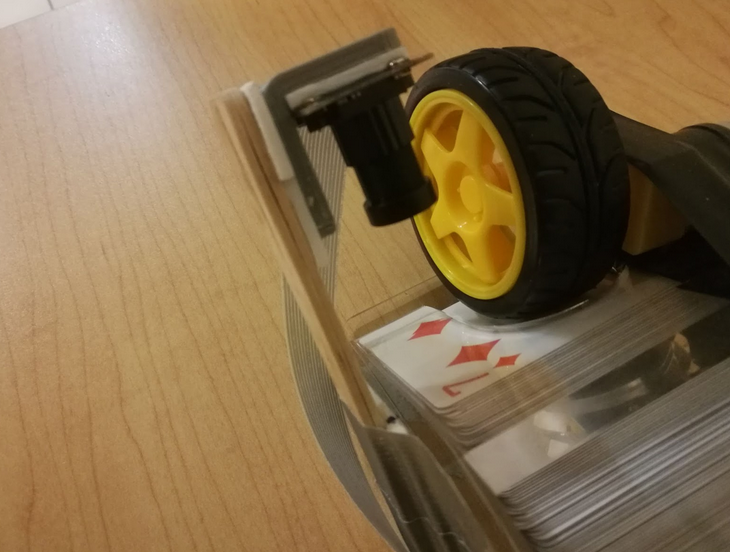
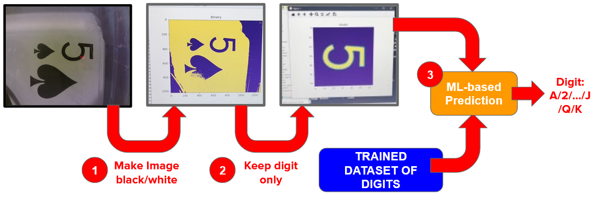
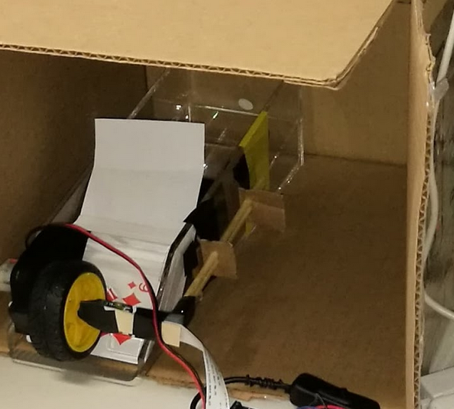

# Jack in a Box
## Summary
This is a one-month long project I completed in a team of five Computer Engineering students. We built a kiosk that allows users to play blackjack against it. Major components of the system include a DE1-SoC board that runs the game's mechanics, a Raspberry Pi board that recognizes cards' face values, a touchscreen that allows user inputs and visual outputs, and a optical-mechanical system to recognize card values and to deal cards.

Here is what the entire kiosk look like:

  

## System Architecture

### Hardware Architecture

The diagram below illustrates the hardware components in our kiosk, and the jobs that each delegates:

*The image is taken from our group report*

### Software Architecture
And here is the diagram that shows the logic of our software components, and how they communicate:

*The image is taken from our group report*

## My role
* Implementing the game's mechanics on the DE1-SoC board with a partner
* Implementing the face value recognition pipeline with other team members
  

## Highlights

### Implementing _Mainframe_ - the game mechanics
Together with [Jaskirat Singh](https://www.linkedin.com/in/jaskiratsinghmalhi/?originalSubdomain=ca), I implemented the blackjack's mechanics as a bare-metal C program running on the ARM Cortex-A9 processor on my DE1 board. We call the program _Mainframe_. The program can respond to touchscreen inputs, issue commands to deal cards, and compute scores for the (human) player and the (kiosk) dealer. Aside from game mechanics, we also implemented a GUI in the C program.

Below are some pictures of an operating instance of _Mainframe_:

*The welcome screen*

*Dealing a card to the dealer*

*The screen that shows game result*

### Implementing card value recognition
One of the requirements for our kiosk is that, it should be able to deal cards automatically, and recognize the face values of the cards it deal. To this end, I implemented a image processing pipeline in Python on a Raspberry Pi board, with the help from my friend [Bole Ma](https://www.linkedin.com/in/david-bole-ma/) (Prior to the project I did not know jack about CV/CG, so he baby-sitted me throughout this part). The major steps within the pipeline are:

1. Take a picture of a card
2. Crop the picture and leave the region with face value only
3. Add padding and resize the left region
4. Extract features from the region
5. Predict face value using a KNN classifer model

Here is the hardware setup of the pipeline. We used a Pi camera firmly mounted on the card holder to take pictures:

Step 2 to 5 are the "ML steps" within the entire pipeline. The diagram below more specifically explains our ML pipeline for face value recognition:

Also we trained the model by ourselves, as opposed to grabbing it from somewhere on the internet. First of all, We built our training set consisting of 9,830 images by manually taking pictures of each face value and conducting data augmentation. Then I trained with two classification algorithms - SVM and KNN. Once training is done, I tested each model under various lightning conditions. Eventually I found that the two models yielded the same performances (100% accuracy with 25 test images), so I just selected KNN as my final choice.

A major challenge we had was choosing between traditional image recognition methods such as template matching and ML-based methods for recognizing card values. And in fact I tested a template matching algorithm and it somehow worked. Eventually we did not use it for its terribly low speed - while our KNN-based algorithm can recognize a digit in less than a second, the template matching algorithm takes roughly 30 seconds! That is intolerable if we want our players to have any fun with our kiosk.

Another challege was ensuring card images we got from our camera are clear. We noticed that if our camera is not well-focused, or some shadows projected on the card, our ML pipeline would perform horribly bad. So we had to build a case to cover our camera:

