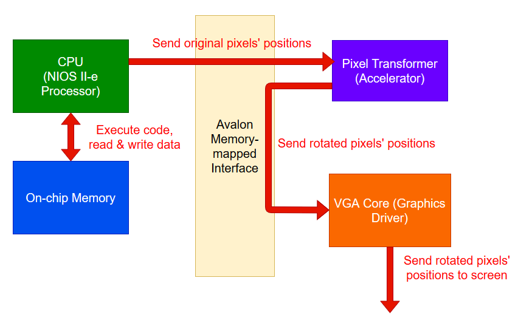

# Pixel Transforming SoC
## Summary
This is a project I worked on for two weeks in Digital Systems Design, a third-year Computer Engineering course. In the project I built a system-on-chip that rotates a a static image by a fixed degree, and prints the rotated image to a screen. The system is comprised of a soft-core CPU, memory, a graphic accelerator, and a graphics driver.
  

## System Architecture
The figure below illustrates the system's architecture.

A static image has its pixels' positions stored in the main memory of the system. The CPU runs some C code that reads the memory, and sends those positions to the FPGA-based accelerator written in SystemVerilog. The accelerator then computes each pixel's position after a rotation, and sends the pixels' positions after rotation to the graphic adapter which prints pixels to a screen.
  

## Highlights
The greatest challenge in the project is letting the CPU talk to the accelerator, and letting the accelerator talk to the graphics driver. As the diagram above has shown, the devices do not talk with each other directly; instead they communicate through the Avalon Memory-mapped interface. You can look into the interface in greater details in [here](https://www.intel.com/content/dam/www/programmable/us/en/pdfs/literature/manual/mnl_avalon_spec.pdf). 
Had I not written the FPGA-based accelerator, pixel rotations could still be done in the CPU. Using the accelerator however boosted the speed of image rotation by 2x.