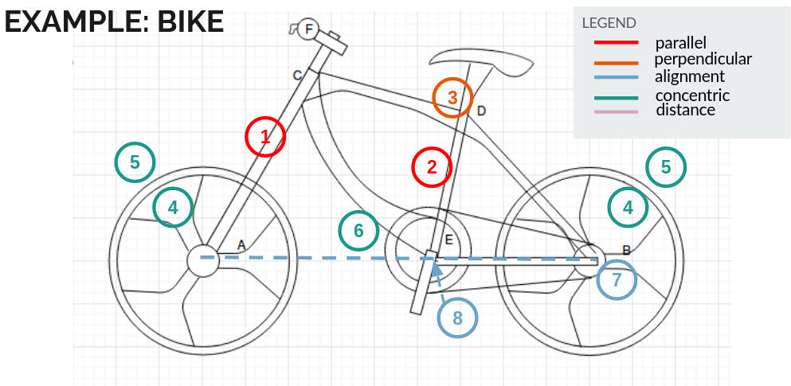

# Volunteering at UBC SPIN (Sensory, Perception & Interaction)

September 2019 to Present

## Summary
The [SPIN Group at UBC](https://www.cs.ubc.ca/labs/spin/frontpage) under [Prof. Karon Maclean](https://www.cs.ubc.ca/labs/spin/content/karon-maclean)'s supervision emphasizes HCI-related research. Over the course of a year at SPIN, I worked on two projects on Magic Pen (a haptic pen) with [Dr. Soheil Kianzad](https://www.cs.ubc.ca/labs/spin/kianzad):
* Integrating open-source, real-time 2D localization to Magic Pen
* Adding support for geometric relationships in haptic sketches 
  

## What is Magic Pen?
Magic Pen is a haptic pen that allows users to produce 2D hand sketches, such as free body diagrams, mechanical prototype designs or simple architectural sketches. It provides users with force feedback to guide them complete drawings. Most notabily, Magic Pen has two features that distinguish it from other haptic devices:

* **Shared control between the pen and user** - although the pen can provide guiding force to restrict a user's hand movement, sometimes the user may rather to be not restricted. The user can apply a stronger force to the pen to "counteract" the guiding force. Upon sensing the user-applied force, the pen will cease to apply the guiding force, so the user can move his/her hand more freely.
* **Geometric relationships defined in sketches** - geometic relationships such as parallel ,perpendicular, and alignment allow people to convey abstract concepts in sketches, and is often employed by CAD software to help users in engineering and artistic design processes. Magic Pen allows users to define geometric relationships between objects, thus allowing them to express abstract concepts in hand sketches.

Here is an illustration of the pen:

*Soheil Kianzad, Yuxiang Huang, Robert Xiao, and Karon E. MacLean. 2020. Phasking on Paper: Accessing a Continuum of PHysically Assisted SKetchING. In Proceedings of the 2020 CHI Conference on Human Factors in Computing Systems (CHI '20). Association for Computing Machinery, New York, NY, USA, 1–12. DOI:https://doi.org/10.1145/3313831.3376134*

Here are some use cases of geometric relationships in hand sketches:

*A hand sketch of a bike. Grabbed from my presentation slides for Karon*

*A hand sketch of a website. Grabbed from my presentation slides for Karon*

You can read more about the project in [here](https://www.cs.ubc.ca/labs/spin/node/388).

## My roles in the Magic Pen project
### Integrating open-source localization capability
For this project we aimed to integrate an open source robot localization library into our haptic pen, which runs a Python program on a Raspberry Pi Zero board. We expected by the end of the project, given camera image feed, the Python program can decode the location of Magic Pen on a flat dotted paper with structured patterns.

The library was developed by people from EPFL, and more details can be found [here](https://www.epfl.ch/labs/chili/dissemination/software/libdots/). Prior to my attempt on the integration, Magic Pen could already localize itself on a flat 2D surface, with the localization capability of SamSung's Neo Smartpen. We wanted to replace Neo Smartpen with the open source library to lower the manufacturing cost.

I encountered a problem however, and because of it have put my integration effort on pause. The problem is that the library could not decode positions on two axes when I ran it on my Raspberry Pi. On other platforms such as a Ubuntu PC the library worked fine. I suspected the issue is architectural compatibility - the library works on X86-64 based or MIPS based CPUs but not ARM based ones. I think architectural compatibility is the problem, because the problem cannot OS-related - it happens on various Linux distributions on my Pi, and because as the authors of the library claimed, the code worked on Ubuntu PCs and PIC32 boards.

#### Adding support for geometric relationships in haptic drawing
This is the part where I made substantial progress. Specifically my tasks involve:

#### Conducting literature review

Before we dived deep into adding this cool feature, we had to ensure that we were doing some pioneering work that no one has done before. Also we wanted to draw some inspiration from previous works.

So Soheil, after doing some fine search of related work, provided me with a list of about 50 papers to look into. For each paper I read the title, the abstract, and searched for key phrases including "haptic pen", "sketching", "constraint", and "relationship". For each paper that is highly relevant to our project, I traced papers that cited it using Google Scholar, and added them to my review list if I found them to be relevant. Eventually I had a list of 69 papers reviewed.

While conducting the review, I found papers upon which we would build our work. In "Sketchpad: a man-machine graphical communication system" Sutherland proposed the first CAD tool that allowed users to define geometric constraints. We got some ideas of what geometric relationships to define from there.

Meanwhile I found some papers that provideed us inspiration for designing our user experiments. The paper "A Model for Steering with Haptic-Force Guidance" for example applies the Steering Law in evaluating users' experience with using a haptic pen. We also had the idea of applying the Steering Law, so knowing that authors of this paper did this as well kind of assures this is a sane approach.

I also confirmed that adding support for geometric relationships is indeed pioneering. People have created CAD tools that allow users to define geometric constraints, and people have created haptic pens that guide users to draw stuff, but no one has combined a haptic pen for hand sketches with support for geometric constraints. 

#### Defining geometric relationships

Soheil and I came up with geometric relationships that Magic Pen supports, as well as for each relationship what kind of shapes should be involved, and the condition under which each relationship gets applied. We defined five relationships - alignment, parallel, perpendicular, concentric, and fix-distance. Here I present to you two examples of applying the alignment relationship on drawn objects:

*grabbed from my presentation slides for Karon*

To create an object (shape), a user needs to define "key points" of the object by pressing the pen on locations where he/she wants the points to be - for example, to define a rectangle, the user presses on where he/she wants the centre to be, then presses on where he/she wants the upper-left corner to be. After both points have been defined, the pen guides the user to complete the rectangle.

In the example on the left, the user has already created the circle. Now she is creating the rectangle, and she is pressing on the location where she wants the centre of the rectangle to be. If the location she presses on has its x-coordinate really close to the x-coordinate of the centre of the circle, then the pen will register the centre of the rectangle at somewhere a bit to the left, so the two centres become aligned.

And under what circumstances are the coordinates "really close", such that the pen applies the alignment relationship? This diagram explains the circumstances:

*grabbed from my presentation slides for Karon*

Essentially the pen checks when defining a point, if some other points have their x or y coordinate within a pre-defined proximity to the point we are about to define.

#### Implementing geometric relationships in Python

Yea of course... with all those relationships defined, I had to code them up, and write up unit tests to make sure they work.

#### Designing the user study

I designed experiments aimed to evaluate the effectiveness of haptic feedback for guiding users to complete constrained paths.