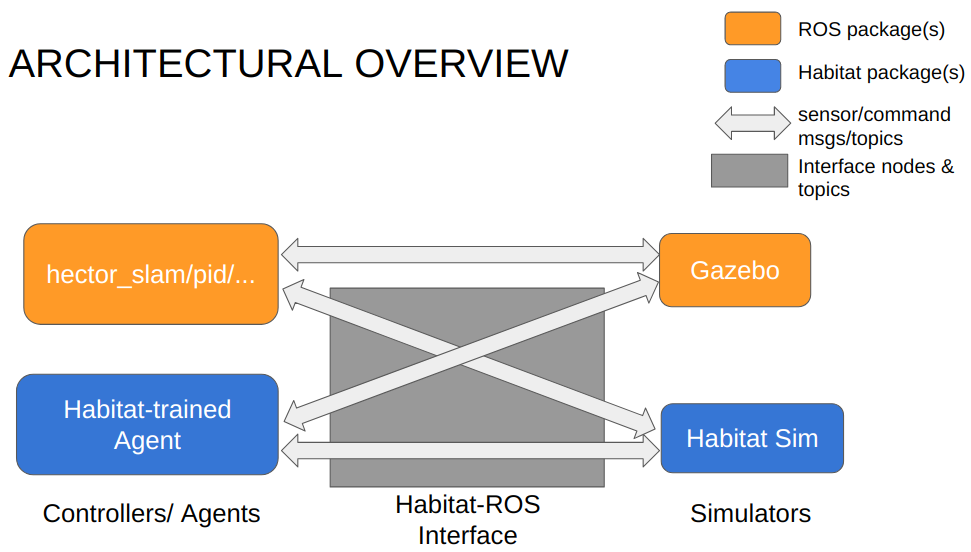

# Volunteering at UBC VCR (Verification, Control, Robotics)

May 2020 to Present

## Summary
Under [Prof. Ian Mitchell](https://www.cs.ubc.ca/~mitchell/)'s supervision, I have been working on a project aimed for building an interface between ROS and AI Habitat. Research areas involved are **physics-based simulation** and **deep reinforcement learning**.
  

## What is AI Habitat and What is ROS? Why Together? And what should the Interface Do?
### What is AI Habitat?
[AI Habitat](https://aihabitat.org/) is a reinforcement learning framework used for training and evaluating embodied agents on various tasks, such as visual navigation and language navigation. The framework consists of two parts: 1) Habitat Lab, an API for task definition, training, testing, and 2) Habitat Sim, a simulator. 

### What is ROS?
[ROS](https://www.ros.org/about-ros/) is a robotics middleware which allows us to develop robotics software on top of. For example, we can construct a SLAM-based agent and simulate it within the Gazebo simulator under the ROS framework.

### Why Together?
AI Habitat provides novel methods for defining tasks and RL-based agents, and a simulator better in photo-realism than Gazebo, the simulator that comes with ROS. ROS on the other hand is where most traditional agents or software in general run within. So we aim to bridge the gap between the frameworks.

### What should the Interface Do?
Built upon existing work by [Bruce Cui](https://ca.linkedin.com/in/brucecui97), I'm continuing the development of the ROS-Habitat Interface. Specifically, for the interface, we want it to be able to
* allow communication between agents trained under Habitat to use ROS-based simulators;
* allow communication between agents from ROS packages work under Habitat Sim.

Here is an architectural diagram of the interface:

*Architecture of ROSxHabitat Interface. Grabbed from my presentation slides for VCR*

To summarize, the interface can work in two modes:
* **Mode A** - in the mode under which the interface allows ROS-based agents run in Habitat Sim, the interface receives linear and angular velocity commands from ROS topic `cmd_vel/`, and it assigns those velocities to the embodied agent in Habitat Sim to enact a movement.
* **Mode B** - in the mode under which the interface allows Habitat-trained RL agents run in either 1) the Gazebo simulator from ROS or 2) in Habitat Sim, the interface receives **discrete-action commands** (such as _move forward by 0.25m_, _turn left by 10 degrees_, etc.) from an RL agent, and converts each command into a set of **linear and angular velocities**. It then publishes the velocities to `cmd_vel/`. Then if we want the Gazebo simulator to simulate the agent, Gazebo would be able to pick up those velocities to enact movements of the embodied agent within. If we want Habitat Sim to simulate the agent, the interface would work in a similar fashion to Mode A - intercepting linear and angular velocity commands from `cmd_vel/` and send them to Habitat Sim.

## My roles in the project
### Updating Mode B - allowing Habitat-trained agents work under ROS simulators
#### Refactoring Existing Work
Bruce has already got a prototypical Mode B working by the time I entered the project. However, AI Habitat has been updated by a lot since Bruce finished the prototype in August 2019. So I picked up on his Python implementation, and refactored it to accomodate updates in AI Habitat.

#### Ensuring Performance Consistency
More importantly, recently updates on Habitat Sim incorporated the Bullet Physics engine to simulate physics effects, such as gravity, collisions, and friction. **These updates have led us to rethink how we should convert discrete actions into continuous velocities. Since the agents are RL-based, how would the conversion affect their performance? We need to make sure the interface has minimal impact on a Habitat-trained agent's performance in a simulation environment - i.e. what I refer as _performance consistency_.** To this end, I have completed or been working on the following tasks:

##### Conducting Literature Review on AI Habitat
To do anything meaningful, I reviewed the paper ["Habitat: a Platform for Embodied AI Research"](https://openaccess.thecvf.com/content_ICCV_2019/papers/Savva_Habitat_A_Platform_for_Embodied_AI_Research_ICCV_2019_paper.pdf) to understand basic concepts of reinforcement learning (RL) and physics-based simulation.

##### Reading Code to Understand Physics Simulation in Habitat Sim
Next, I reviewed AI Habitat's code base to understand how 
* Habitat Sim communicates with the Bullet Physics backend;
* Habitat Sim simulates agents of _motion type_ `KINEMATIC`, `DYNAMIC` or the default type differently. For example, to simulate an agent's movement, Habitat Sim 1) "teleports" a default agent from one position in space to another using affine transformations; 2) integrates a `KINEMATIC` agent's angular and linear velocities over time steps; 3) sends a `DYNAMIC` agent's angular and linear velocities to the Bullet Physics engine and let the engine does the rest. 

##### Selecting Action Space Conversion Parameters
So far, I have considered the following key parameters for conversion from discrete commands to continuous velocities - 
* Magnitudes of angular and linear velocities: I have decided to use hard-coded velocities. For example, for the action  _move forward by 0.25m_, an agent would move forward with the speed of 0.25 m/sec for one second.
* Simulation time step: I have decided to use 1/60 sec, the default number set in Habitat Sim.

These numbers have really been just arbitrarily set. I will later test how they will affect performance consistency.

##### Evaluating Performance Consistency in Mode B
I am writing a script to instantiate a Habitat-trained agent, let it complete multiple point-goal navigation episodes, and compare its performance between 1) running in Habitat Sim with discrete action outputs and 2) running in Habitat Sim with continuous velocities as outputs. The comparision will allow me to know if the parameters I have selected in the previous step can ensure performance consistency or not. If not, I will investigate why.

Besides Habitat Sim, I will carry out the same comparision in other simulators, such as Gazebo.

### Evaluating Overall Performance Consistency
Once Mode B is completed, we will have the full interface. Then I will conduct experiements to make sure the interface also ensures consistency in Mode A. 
